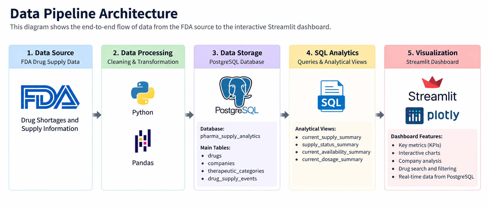
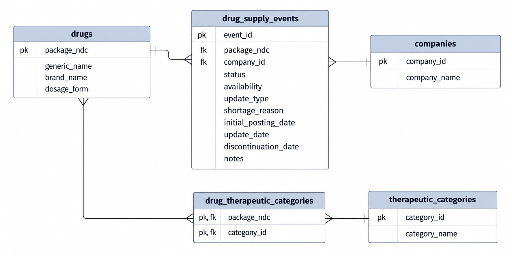
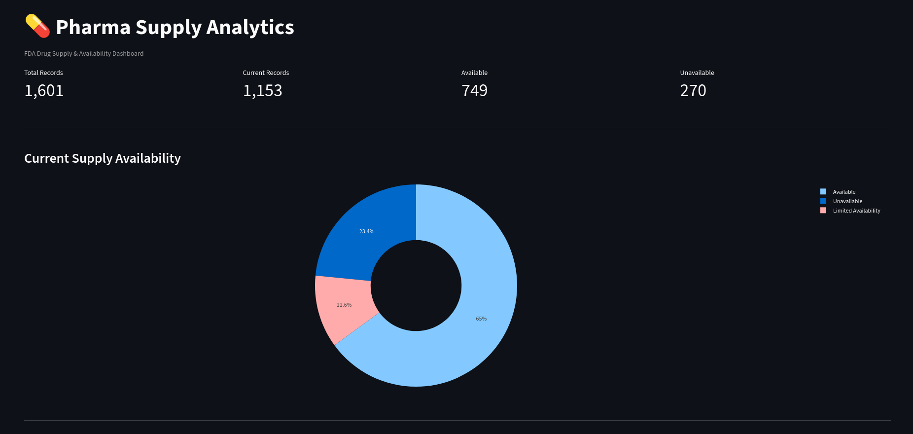
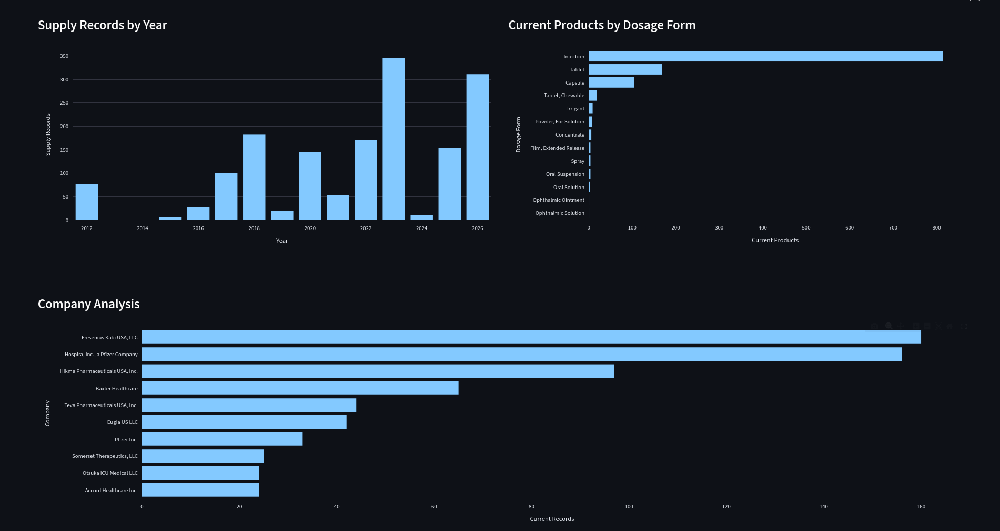
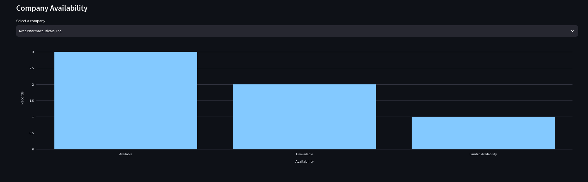

# 💊 Pharma Supply Analytics

## Objective

In this project, I designed and implemented an end-to-end data analytics pipeline for analyzing pharmaceutical drug supply and availability data.

The project consists of several stages:

1. Collected and cleaned FDA drug supply data using Python.
2. Designed and normalized the data model in PostgreSQL.
3. Loaded and managed the data using a PostgreSQL database.
4. Performed SQL-based analytical queries to identify supply status, availability, companies, therapeutic categories, dosage forms, and time-based trends.
5. Created reusable PostgreSQL views for dashboard analytics.
6. Developed an interactive dashboard using Streamlit and Plotly.

The main emphasis of this project is on **data engineering, SQL analytics, database design, and interactive data visualization**.

---

## Table of Contents

- [Dataset Used](#dataset-used)
- [Technologies](#technologies)
- [Data Pipeline Architecture](#data-pipeline-architecture)
- [Data Modeling](#data-modeling)
- [Step 1: Data Collection and Cleaning](#step-1-data-collection-and-cleaning)
- [Step 2: PostgreSQL Storage](#step-2-postgresql-storage)
- [Step 3: SQL Analytics](#step-3-sql-analytics)
- [Step 4: Analytical Views](#step-4-analytical-views)
- [Step 5: Streamlit Dashboard](#step-5-streamlit-dashboard)
- [Project Structure](#project-structure)
- [Setup](#setup)
- [Key Results](#key-results)

---

## Dataset Used

This project uses pharmaceutical drug supply and shortage information containing details such as:

- Drug package NDC
- Generic name
- Brand name
- Pharmaceutical company
- Supply status
- Availability
- Shortage reason
- Update type
- Initial posting date
- Update date
- Discontinuation information

The dataset is used to analyze the current and historical supply status of pharmaceutical products.

> **Source:** FDA Drug Shortages / Drug Supply Data

---

## Technologies

The following technologies were used to build this project:

- **Language:** Python, SQL
- **Database:** PostgreSQL
- **Data Processing:** Pandas
- **Visualization:** Plotly
- **Dashboard:** Streamlit
- **Database Connectivity:** Psycopg2
- **Environment Management:** python-dotenv
- **Version Control:** Git, GitHub

---

## Data Pipeline Architecture



The pipeline separates data storage, analytics, and visualization so that PostgreSQL handles the database operations while Streamlit is responsible for presenting the results.

---

## Data Modeling

The database was designed using normalized relational tables to reduce duplication and maintain relationships between pharmaceutical products, companies, therapeutic categories, and supply events.

The main entities include:

* `drugs`
* `companies`
* `therapeutic_categories`
* `drug_supply_events`

### Relationship



---

# Step 1: Data Collection and Cleaning

The initial dataset was processed using Python before loading it into PostgreSQL.

The cleaning process included:

1. Standardizing column names and data formats.
2. Cleaning missing and inconsistent values.
3. Converting date columns into appropriate date formats.
4. Preparing company and drug information for normalization.
5. Removing unnecessary duplication where applicable.
6. Preparing the final CSV data for PostgreSQL ingestion.

The cleaned data was then loaded into PostgreSQL for further analysis.

---

# Step 2: PostgreSQL Storage

A PostgreSQL database named:

```text
pharma_supply_analytics
```

was created to store the processed data.

The database contains the following main tables:

```text
drugs
companies
therapeutic_categories
drug_supply_events
```

The supply event table stores individual supply records while the related dimension tables store reusable information about drugs, companies, and therapeutic categories.

Example:

```sql
SELECT
    status,
    COUNT(*) AS records
FROM drug_supply_events
GROUP BY status;
```

PostgreSQL was selected to handle relational data, joins, aggregations, filtering, and analytical queries efficiently.

---

# Step 3: SQL Analytics

After loading the data, SQL was used to perform analytical queries.

### Supply Status

The dataset currently contains:

| Status             | Records | Percentage |
| ------------------ | ------: | ---------: |
| Current            |   1,153 |     72.02% |
| To Be Discontinued |     441 |     27.55% |
| Resolved           |       7 |      0.44% |

### Current Availability

Among current supply records:

| Availability         | Records | Percentage |
| -------------------- | ------: | ---------: |
| Available            |     749 |     64.96% |
| Unavailable          |     270 |     23.42% |
| Limited Availability |     134 |     11.62% |

### Top Companies

The companies with the highest number of current supply records include:

| Company                         | Current Records |
| ------------------------------- | --------------: |
| Fresenius Kabi USA, LLC         |             160 |
| Hospira, Inc., a Pfizer Company |             156 |
| Hikma Pharmaceuticals USA, Inc. |              97 |
| Baxter Healthcare               |              65 |
| Teva Pharmaceuticals USA, Inc.  |              44 |

### Therapeutic Categories

The largest therapeutic categories by unique package NDCs include:

| Category         | Products |
| ---------------- | -------: |
| Anesthesia       |      361 |
| Pediatric        |      277 |
| Psychiatry       |      270 |
| Gastroenterology |      165 |
| Neurology        |      163 |

### Current Dosage Forms

| Dosage Form      | Current Products |
| ---------------- | ---------------: |
| Injection        |              815 |
| Tablet           |              169 |
| Capsule          |              104 |
| Tablet, Chewable |               18 |

These queries form the analytical foundation of the dashboard.

---

# Step 4: Analytical Views

To simplify dashboard development, reusable PostgreSQL views were created.

### Current Supply Summary

```sql
CREATE OR REPLACE VIEW current_supply_summary AS
SELECT
    e.event_id,
    e.package_ndc,
    d.generic_name,
    d.brand_name,
    d.dosage_form,
    c.company_name,
    e.status,
    e.update_type,
    e.availability,
    e.shortage_reason,
    e.initial_posting_date,
    e.update_date
FROM drug_supply_events e
JOIN drugs d
    ON e.package_ndc = d.package_ndc
JOIN companies c
    ON e.company_id = c.company_id
WHERE e.status = 'Current';
```

Additional analytical views were created for:

* Supply status
* Current availability
* Current dosage forms

Using views keeps the dashboard queries simple and moves repeated analytical logic into PostgreSQL.

---

# Step 5: Streamlit Dashboard

The Streamlit application connects directly to PostgreSQL using `psycopg2`.

The dashboard currently provides:

### KPI Cards

* Total supply records
* Current records
* Available records
* Unavailable records

### Visualizations

* Current supply availability
* Supply records by year
* Current products by dosage form
* Top pharmaceutical companies
* Company-specific availability

### Interactive Analysis

Users can select a pharmaceutical company and dynamically view its current availability distribution.

The dashboard uses:

```text
PostgreSQL
     ↓
Pandas
     ↓
Plotly
     ↓
Streamlit
```

---

## Project Structure

```text
pharma-supply-analytics/
├── architecture.md
├── dashboard.py
├── data
│   ├── companies.csv
│   ├── drugs.csv
│   ├── drug_shortages_clean.csv
│   ├── drug_shortages_raw.csv
│   └── drug_therapeutic_categories.csv
├── README.md
├── requirements.txt
├── screenshots
│   ├── dashboard-1.png
│   ├── dashboard-2.png
│   └── dashboard.png
└── scripts
    ├── clean_data.py
    ├── explore_data.py
    ├── fetch_shortages.py
    └── profile_data.py

```

> `.env` contains local database credentials and should never be committed to GitHub.

---

## Setup

### 1. Clone the repository

```bash
git clone https://github.com/<USERNAME>/pharma-supply-analytics.git
cd pharma-supply-analytics
```

### 2. Create a virtual environment

```bash
python -m venv .venv
source .venv/bin/activate
```

### 3. Install dependencies

```bash
pip install -r requirements.txt
```

### 4. Configure environment variables

Create a `.env` file:

```env
DB_HOST=localhost
DB_PORT=5432
DB_NAME=pharma_supply_analytics
DB_USER=postgres
DB_PASSWORD=your_password
```

### 5. Create the PostgreSQL database

```sql
CREATE DATABASE pharma_supply_analytics;
```

Load the project tables and analytical views into the database.

### 6. Run the dashboard

```bash
streamlit run dashboard.py
```

The dashboard will be available at:

```text
http://localhost:8501
```

---

## Key Results

The current dataset contains:

* **1,601** total supply records
* **1,153** current records
* **749** available current records
* **270** unavailable current records
* **815** current injection products
* **361** unique package NDCs associated with the Anesthesia category

These metrics are calculated directly from the PostgreSQL database and may change when the underlying dataset is updated.

---

## Project Status

🚧 **In Development**

Planned improvements include:

* Drug search and NDC explorer
* Advanced dashboard filters
* Drug-level detail view
* Shortage-reason analysis
* Exportable analytical reports
* Deployment of the Streamlit dashboard


## Step 5: Streamlit Dashboard




